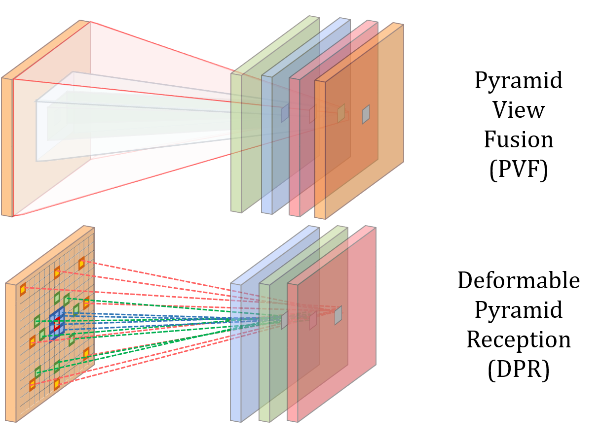
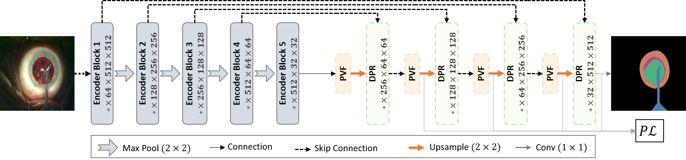
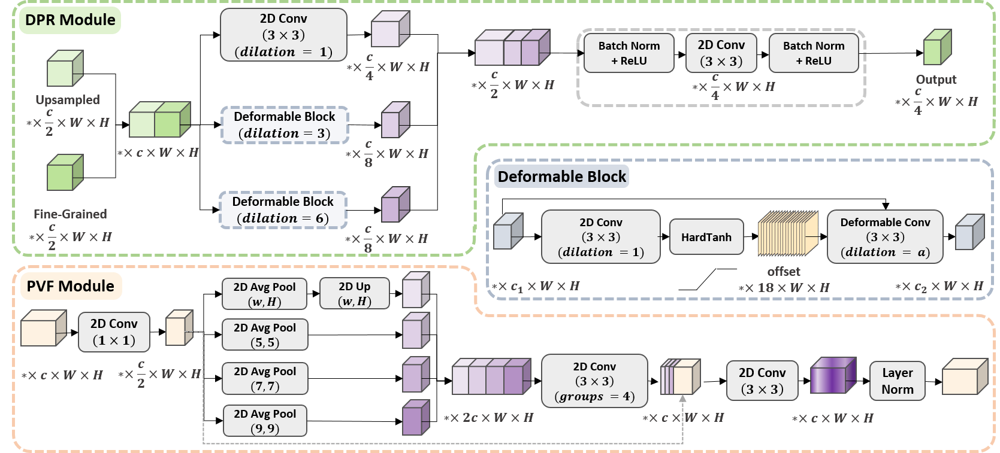
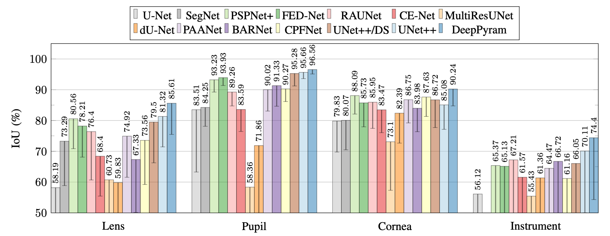
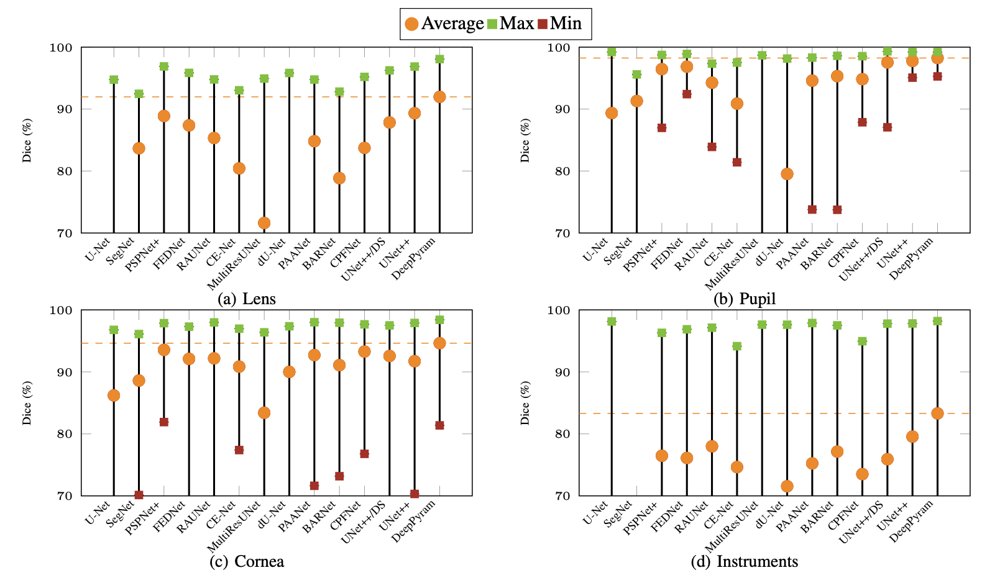

# DeepPyram_MICCAI2022

This repository provides the official PyTorch implementation of DeepPyram (Pyramid View and Deformable Pyramid Reception).

DeepPyram is initially proposed for semantic segmentation in cataract surgery videos, but can be adopted for any medical or general purpose image segmentation problem.

Our proposed network, {\it DeepPyram}, introduces three key contributions: (i) a Pyramid View Fusion (PVF) module allowing a varying-angle surrounding view of the feature maps for each pixel position, (ii) a Deformable Pyramid Reception (DPR) module, which enables a large, sparse, and learnable receptive field to perform shape-wise feature extraction (see Fig.~\ref{fig: Problems}-b), and (iii) a Pyramid Loss, ($P\mathcal{L}$) to explicitly supervise multi-scale semantic feature maps in our network.

---

**Proposed Pyramid View Fusion and Deformable Pyramid Reception modules.**

Conceptually, the PVF module is inspired by the human visual system and aims to recognize semantic information found in images considering not only the internal object's content but also the relative information between the object and its surrounding area. Thus the role of the PVF is to reinforce the observation of relative information at every distinct pixel position. Specifically, we use average pooling to fuse the multi-angle local information for this novel attention mechanism. 

Conversely, our DPR module hinges on a novel deformable block based on dilated convolutions that can help recognize each pixel position's semantic label based on its cross-dependencies with varying-distance surrounding pixels without imposing additional trainable parameters. Due to the inflexible rectangle shape of the receptive field in regular convolutional layers, the feature extraction procedure cannot be adapted to complex deformable shapes. Our proposed dilated deformable convolutional layers attempt to remedy this explicitly in terms of both scale and shape. We now specify these modules and our loss function in the following subsections. 



---

**Overall architecture of the proposed DeepPyram network.**

Using a U-Net-based architecture, our proposed model is illustrated below. At its core, the encoder network remains that of a standard VGG16 network. Our approach is to provide useful decoder modules to help alleviate segmentation concerning relevant objects' features in cataract surgery. Specifically, we propose a Pyramid View Fusion (PVF) module and a Deformable Pyramid Reception (DPR) module. These are then trained using a dedicated Pyramid Loss ($P\mathcal{L}$). 



---

**Detailed architecture of the Deformable Pyramid Reception (DPR) and Pyramid
View Fusion (PVF) modules.**



---

**Quantitative comparisons among DeepPyram and rival approaches based on average and standard deviation of IoU.**



---

**Quantitative comparison of segmentation results for the proposed (DeepPyram) and rival architectures based on Dice coefficient (some minimum
and average values are not visible due to y-axis clipping).**



---

**Visualization of the effect of the proposed and alternative modules based on class activation maps. For each approach, the figures from left to right represent the gray-scale activation maps, heatmaps, and heatmaps on images for a representative input image from the test set.**


---


## Citation
If you use AdaptNet for your research, please cite our paper:

```
@INPROCEEDINGS{DeepPyram,
  author={N. {Ghamsarian} and M. {Taschwer} and R. {Sznitman} and K. {Schoeffmann}},
  booktitle={25th International Conference on Medical Image Computing \& Computer Assisted Interventions (MICCAI 2021)}, 
  title={DeepPyram: Enabling Pyramid View and Deformable Pyramid Reception for Semantic Segmentation in Cataract Surgery Videos}, 
  year={2022},
  volume={},
  number={},
  pages={to appear},}
```

## Acknowledgments

This work was funded by Haag-Streit Switzerland and the FWF Austrian Science Fund under grant P 31486-N31.
